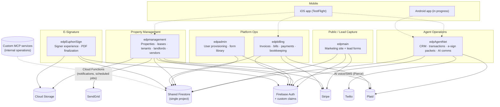

# EDP Ecosystem — Public Technical Overview

**A sanitized technical overview of a production real-estate operations platform, written for engineering hiring managers.**

> ⚠️ **This is not the production repository.** It contains no application source code, no credentials, no customer data, and no infrastructure details. Everything here is original prose, diagrams, and clearly fictional example data written to explain *how* the real system is built and *why*, at a level safe for public viewing. See [`SECURITY_REVIEW.md`](SECURITY_REVIEW.md) for the audit performed before publication.

---

## Positioning

I'm Andrew Bowlds — a managing broker who conceived, directed, and operates **Euphoric Development Partners (EDP)**, a real-estate brokerage and property-management business, along with the software ecosystem that runs it. I'm looking for **delivery-focused, non-quota-carrying roles across AI deployment, implementation, deployed product, adoption, technical program management, and technical success**. I'm comfortable working directly with customers on discovery, workshops, demonstrations, pilots, solution design, delivery, and adoption when the company supplies the customer relationships and scheduled engagements. My best fit is helping customers solve operational problems—not cold outreach, self-generated pipeline, or commission-based sales.

For several years I've run real-estate operations as a broker. Since **April 2025** I've been designing and building the software platform described here: six interconnected web applications plus native mobile clients, deployed and receiving regular updates, running the day-to-day operations of the business. I conceived the product, identified the business problems and users, defined the requirements and workflows, and directed the architecture and integrations. I used AI coding assistants in VS Code for much of the line-by-line implementation, working from my own specifications — and I reviewed, tested, troubleshot, deployed, and operate every part of it. See [My Role & Methodology](#my-role--ai-assisted-development-methodology) for the honest version of that, including where I've learned the most.

## The Business Problem

EDP is a small brokerage and property-management company. Like most independent brokerages, it faced a stack of overlapping problems that off-the-shelf SaaS tools solve individually but not together:

- Lead capture, marketing, and SEO for the public-facing brokerage
- Agent CRM and transaction/deal management, with the paperwork-heavy compliance trail real-estate transactions require
- Property management: leasing, rent workflows, maintenance coordination, landlord/tenant/vendor communication
- Billing and bookkeeping across multiple revenue lines
- Tamper-evident electronic signatures on the volume of documents a brokerage generates
- A way for a very small team to be responsive across phone, text, and email without a large support staff

Buying six different SaaS products doesn't share data cleanly and doesn't let you automate *across* systems. I built one connected ecosystem sharing a single data backend, and layered AI-agent automation on top of the highest-volume communication and coordination work.

## Users & Scope

This is a deployed production system running one real brokerage's operations. It supports:

| User type | Count | Note |
|---|---|---|
| Operator (me) | 1 | Product owner and operator |
| Real-estate agents | 5 | Using the CRM/transaction system |
| Landlords | ~10 | Property owners in the property-management app |
| Tenants | ~20 | Renters with leases and ledgers |
| Vendors | ~20 operationally engaged | Service providers who have received dispatched work or actively participate in EDP workflows |

Plus the public/marketing surface, which handles inbound leads and applicants on an ongoing basis. These figures describe current usage, not capacity. The broader vendor directory contains approximately 110 records, with approximately 40 marked active; about 20 vendors have received dispatched work or actively participate in EDP workflows. Those figures measure different levels of engagement rather than conflicting user counts.

## System Overview

Six web applications sharing one Firebase/Firestore backend, plus native mobile clients and a set of custom MCP (Model Context Protocol) services used for internal operations. Cross-app communication is primarily direct, scoped Firestore access governed by security rules, plus a handful of HTTP endpoints (user provisioning, activity logging, magic-link SSO, push-token registration).



See [`diagrams/ecosystem-architecture.mmd`](diagrams/ecosystem-architecture.mmd) for the full-detail version and [`docs/architecture.md`](docs/architecture.md) for the write-up.

## Major Applications

| App | Role | Status |
|---|---|---|
| **edpmain** | Public marketing site, SEO, lead capture (10+ distinct lead forms), and the production Stripe checkout path for invoice payments | Live |
| **edpAgentNet** | Agent CRM, transaction/deal management, document OCR, e-sign packet creation, AI voice/SMS communications | Live (largest, most complex app) |
| **edpmanagement** | Property/unit/lease management, landlord & tenant & vendor portals, maintenance workflows, rent-payment and disbursement pipeline | Live (most heavily tested app) |
| **edpadmin** | User provisioning, role/claims administration, shared form-template library, centralized activity logging | Live (small control plane) |
| **edpbilling** | Invoices, vendor bills, payment ledger, Plaid-based bookkeeping | Live |
| **edpEuphoriSign** | In-house e-signature product — signer experience, PDF flattening, tamper-evident audit trail | Live, single-tenant |
| **Mobile (iOS / Android)** | Native clients for agents, landlords, tenants, prospects | iOS distributed via TestFlight (not yet publicly released); Android in limited internal use, not production-ready |

Full detail per app — including explicitly-planned and explicitly-not-yet-built features — is in [`docs/project-status.md`](docs/project-status.md).

## Payments & Rent (stated precisely)

Payments are the area most prone to overstatement, so here is the exact, verified picture:

- **Invoice payments** run through a production **Stripe Checkout** path and are the live payment flow for the ecosystem.
- **Rent collection through the EDP app is production-capable.** The property-management app implements a real tenant rent-charge flow via Stripe Checkout and a landlord-disbursement pipeline built on **Stripe Connect**, including a held-funds state for landlords who have not yet completed payment onboarding. The charge → ledger → disbursement path exists end-to-end in code.
- **A third-party property-management platform is also reconciled with EDP.** Internal tooling keeps relevant external records aligned with EDP's tenants, leases, ledgers, and per-unit accounting. This overview does not claim a specific share of rent volume for either payment path.
- **Plaid** is used for bank-account linking and transaction import in the bookkeeping flows.

The distinction I want to be clear about: rent collection is a *production-capable feature that exists and works*. This overview does not imply a transaction volume that has not been independently documented.

## AI & Automation

The most distinctive part of the system is **Pierce**, an AI property-management agent that communicates on the business's behalf by phone, text, and email, and that responds to operational events (such as new maintenance requests) with actions taken against authorized operational data. Pierce is built on OpenAI's real-time/voice capabilities for phone conversations, with a supporting event pipeline:

- **Event triggers**: Firestore-triggered Cloud Functions fire when relevant records (maintenance requests, applications, tours) are created
- **Context**: the agent works from a notification pipeline and scoped access to operational data
- **Human-in-the-loop**: the system includes ongoing work to strengthen capability-scoped authorization, server-side policy enforcement, and human-approval controls — I describe these as active priorities rather than finished features in [`docs/ai-agent-system.md`](docs/ai-agent-system.md)

The architecture is designed to support additional specialized agent roles beyond Pierce; Pierce is the one operating in the property-management workflow today. I deliberately do not claim a specific count of production agents — see the AI-agent doc for how I distinguish what's deployed from what's designed-for.

Separately, custom MCP (Model Context Protocol) services are used internally to operate business data and a third-party property-management platform through an AI assistant, with scoped access controls. This is internal operator tooling, not an end-user product.

## Verified Technology Stack

- **Frontend/backend**: Next.js (14–16) + React (18–19) + TypeScript across all six web apps, on Radix UI + Tailwind
- **Database**: Firebase/Google Cloud Firestore, one shared project across all apps
- **Auth**: Firebase Authentication with custom claims for role-based access (an authorization model being migrated toward claims from an older stored-role approach)
- **Hosting**: Firebase App Hosting (Cloud Run-backed)
- **Serverless**: Firebase Cloud Functions (2nd gen) for Firestore triggers, scheduled jobs, and callable functions — concentrated in the property-management app
- **AI/LLM**: Google Genkit + Gemini for in-app AI flows (document Q&A, vendor-quote summarization, W-9 extraction, maintenance analysis); OpenAI (real-time voice, TTS, transcription) for the phone-based agent
- **Payments**: Stripe (Checkout, and a Connect-based disbursement pipeline), Plaid (bank linking, transaction import)
- **Communications**: Twilio (voice + SMS), SendGrid (transactional email)
- **Documents**: an in-house e-signature engine (not a DocuSign/HelloSign integration) built on `pdf-lib`, plus Tesseract.js OCR for form-field detection
- **Mobile**: native Swift/SwiftUI (iOS, distributed via TestFlight) and Kotlin/Jetpack Compose (Android, limited internal use)

Full stack detail — including dependencies that are installed but not actively used, flagged explicitly — is in [`docs/architecture.md`](docs/architecture.md).

## Representative Workflows

- **Rental lead → tour → lease**: a lead comes in through the public site or a listing partner → pre-screening → showing-scheduling → self-showing check-in → lease origination
- **Maintenance request → resolution**: tenant submits a request → property manager, landlord, and any assigned vendor are notified → the request enters an agent-visible workflow with time-based escalation → resolution is logged
- **Transaction → closing**: an agent opens a deal in the CRM → documents move through OCR-assisted field detection and e-signature routing → the transaction feeds the billing app
- **Rent charge → disbursement (production-capable)**: a tenant charge is created → the tenant pays through a Stripe Checkout page → a landlord disbursement record is created via Stripe Connect, held if the landlord isn't yet onboarded, releasable once they are

Sequence-level detail for the maintenance/agent flow is in [`diagrams/agent-event-flow.mmd`](diagrams/agent-event-flow.mmd); the e-sign flow is in [`diagrams/document-workflow.mmd`](diagrams/document-workflow.mmd).

## My Role & AI-Assisted Development Methodology

I conceived the product, identified the business problems and users, defined the requirements and workflows, and directed the architecture, data model, and third-party integrations across all six web applications and the native mobile clients. I did not hand-write most of the code — I used AI coding assistants in VS Code for much of the line-by-line implementation, working from my own specs, and I reviewed, tested, debugged, deployed, and operate every part of the resulting system as the person accountable for it.

I think it's dishonest in both directions to claim I hand-authored the entire codebase, or to describe this as "just prompting." The skill this exercised, repeatedly, in real production operation since April 2025, is: knowing what to build and why, specifying it precisely enough for an AI assistant to implement well, reading and evaluating the code it produced, catching where it was subtly wrong (see [`docs/lessons-learned.md`](docs/lessons-learned.md) for real examples), and being accountable for what shipped. That's the AI-native product and deployment work I want to continue doing.

## Engineering Decisions & Tradeoffs

Full writeup in [`docs/engineering-decisions.md`](docs/engineering-decisions.md). Highlights:

- **Why seven separate apps instead of one monolith**: independent deploy cadence per surface and better-fitting hosting — at the cost of schema drift across apps, which is tracked and managed with a documented canonical vocabulary rather than left implicit.
- **Sharing one Firestore project across apps**: fast to build and trivially consistent, with authorization handled through Firestore security rules — a deliberate tradeoff I'd revisit at larger scale by introducing an internal API layer.
- **Migrating a live authorization model** from stored role fields toward custom claims without downtime — a real example of evolving auth on a system with active users, using a compatibility layer during the transition.

## Security & Privacy

Full writeup in [`docs/security-and-privacy.md`](docs/security-and-privacy.md). Short version: role-based Firestore security rules with ownership/relationship-based data isolation, Firebase Auth custom claims, secrets kept out of source control, emulator-backed authorization tests for the highest-risk app, and clearly-scoped internal tooling. The system includes ongoing work to strengthen capability-scoped authorization, server-side policy enforcement, and human-approval controls; I describe those as active priorities, not finished features.

## Testing & Production Operations

Full writeup in [`docs/testing-and-operations.md`](docs/testing-and-operations.md). Testing is genuine but uneven: the property-management app has emulator-backed security-rules tests and CI gating merges on typecheck + tests + build; some apps have lighter coverage. I state this plainly because an honest testing story is more useful than a polished one.

## Current Limitations & Next Improvements

- Multi-tenant SaaS support (serving brokerages beyond EDP) is a direction with partial groundwork, not a shipped capability — tracked honestly in [`docs/project-status.md`](docs/project-status.md).
- Strengthening the AI-agent system's server-side policy enforcement and human-approval controls is an active engineering priority, described at that level in [`docs/ai-agent-system.md`](docs/ai-agent-system.md).
- Automated test coverage should extend to the apps that currently have less of it.
- Field-naming consistency across apps is being migrated to a documented canonical standard using a dual-write/backfill/cutover pattern, because this is a live system with real data.

## Links

- [LinkedIn](https://www.linkedin.com/in/andrew-bowlds-122875125/)
- [GitHub](https://github.com/andrewbowlds)
- Résumé available upon request through LinkedIn

---

## Repository Contents

```text
edpapp-public/
├── README.md                      # this file
├── LICENSE
├── SECURITY.md                    # responsible disclosure notice
├── CONTRIBUTING.md
├── SECURITY_REVIEW.md             # pre-publication security audit of this repo
├── docs/
│   ├── architecture.md
│   ├── ai-agent-system.md         # Pierce, described at a safe level
│   ├── engineering-decisions.md
│   ├── security-and-privacy.md
│   ├── testing-and-operations.md
│   ├── lessons-learned.md
│   └── project-status.md          # live / partial / experimental / planned, per feature
├── diagrams/                      # Mermaid source, renders natively on GitHub
│   ├── ecosystem-architecture.mmd
│   ├── agent-event-flow.mmd
│   └── document-workflow.mmd
├── images/
│   └── README.md                  # what screenshots to add, and how to redact them
└── examples/
    ├── fictional-event.json
    └── fictional-agent-response.json
```
