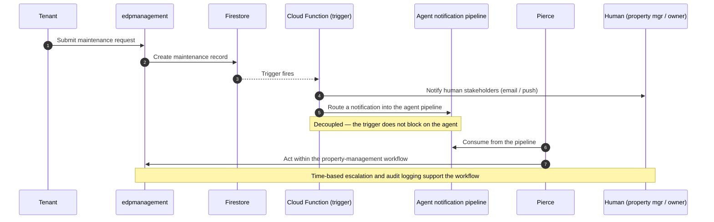

# AI-Agent System — Pierce

This document describes the AI-agent side of the system at an architectural level. It intentionally keeps to *what the system does and how it's structured*, and describes safety work as active priorities rather than enumerating specific weaknesses — a public overview is not the place to publish an operational map of a live system's soft spots.

## What Pierce is

**Pierce is an AI property-management agent** that represents the business on the phone, over SMS, and over email, and that responds to operational events — such as new maintenance requests — by acting against authorized operational data.

Pierce is not a single monolithic component; it's a persona implemented across a few surfaces:

- **Voice (live phone calls)** — telephony and speech-to-text are handled by Twilio; the conversation is driven by an **OpenAI** model with a defined set of function-calling tools; responses are synthesized back to speech. This is a real, working, latency-instrumented conversational agent and the most mature part of the system.
- **SMS and email** — inbound messages are associated with the right contact and context, then handled through an agent runtime that produces the conversational response.
- **Event-driven work** — when relevant records are created, the system routes a notification into an agent-visible pipeline, and Pierce acts on those items as part of the property-management workflow.

One honest scoping note for a technical reader: the **voice agent's model dependency (OpenAI) is implemented directly in the application code**, while the reasoning for SMS/email and longer-running background decisions runs in a separate agent runtime that is not part of the application repository. So the publicly-describable, in-app portion is the voice agent and the event pipeline that feeds the agent; the conversational reasoning for other channels lives in a component outside that codebase. I flag this because it changes what any reader can actually verify from source.

## Pierce and the broader agent design

The system's architecture is designed to support **additional specialized agent roles** beyond property management (for example, roles oriented around lead follow-up or transaction coordination). Today, **Pierce is the agent operating in the property-management workflow**, and it is the only agent I describe as production-operating here.

I deliberately **do not claim a specific number of production AI agents.** Internal documents describe a roster of *possible* agent roles as a capability concept, but that is design intent, not a count of deployed, production-operating personas — and I'm not going to present design intent as deployment. Pierce is the concrete, documented one.

## End-to-end event flow: a maintenance request

This is a real, traced flow, described at a level that explains the design without publishing operational internals:

1. A tenant submits a maintenance request; the property-management app writes the record.
2. A Firestore-triggered Cloud Function fires. It notifies human stakeholders (property manager, landlord, tenant, assigned vendor) and, separately, routes a notification into the agent pipeline. The trigger is decoupled from the agent — it completes its own work regardless of what the agent does.
3. Pierce consumes from the pipeline and acts within the property-management workflow (for example, engaging with vendor coordination for the request).
4. Time-based escalation handles requests that go stale, and agent actions are recorded to audit logs.

## Safeguards: implemented vs. active priorities

I want to distinguish what exists from what is being strengthened, and not describe a desirable control as if it were already in place.

**Implemented today:**

- **Audit logging is real and used.** Agent communications and actions are recorded to dedicated log collections with actor/action/timestamp information, and there are internal views that surface agent activity to human administrators. This is queried in practice, not decorative.
- **Role-based access control on the human-facing administration surfaces**, enforced through Firebase authentication and role checks.
- **Decoupling** between event producers and the agent, so core data writes never depend on agent availability.

**Active priorities (work in progress, not finished features):**

The system includes ongoing work to strengthen **capability-scoped authorization** for what agents can do, **server-side policy enforcement** of business limits (so that important constraints are enforced in application code rather than relying solely on model instructions), and **human-approval controls** for agent-initiated actions that reach customers or vendors. I describe these as priorities because that's what they are — the maturity of an AI system that already touches production is exactly the kind of thing that should be characterized honestly rather than overstated.

## Why this is the work I want

The roles I'm targeting are the ones where someone has to look at an AI system that already interacts with production and real people, reason clearly about where its real safety boundaries are versus where they *should* be, and prioritize closing that gap correctly. I've been doing exactly that on my own system: the highest-value engineering direction here is moving important business constraints and approval steps into server-side, testable enforcement, and I understand precisely why that's the priority. Being able to see that clearly, and rank it correctly, is the skill — and it's the reason I built this overview to describe the direction of the work rather than to catalog the system's current soft spots.

## Status summary

| Capability | Status |
|---|---|
| Pierce voice agent (OpenAI, live phone, tool-calling) | Live — in-app implementation, latency-instrumented |
| Pierce SMS / email | Live — conversational reasoning runs in an agent runtime outside the application repo |
| Event → agent pipeline (Cloud Functions) | Live on the producing side; the agent consumes from it |
| Time-based escalation for stale requests | Live |
| Audit logging of agent actions | Live |
| Capability-scoped authorization, server-side policy enforcement, human-approval controls | Active priorities — being strengthened, not presented as complete |
| Number of production AI agents beyond Pierce | Not claimed — architecture supports additional roles; Pierce is the one operating today |
