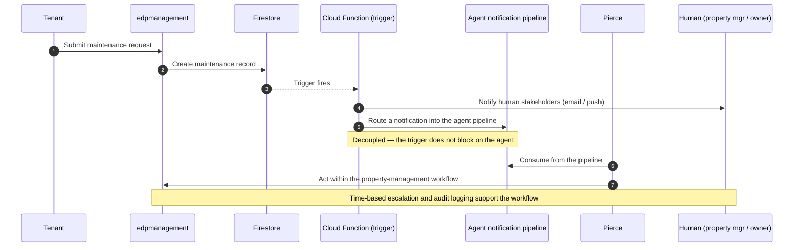

# AI-Agent System — Specialized Roles, Tools, and Controls

This document describes the AI-agent side of the system at an architectural level. It intentionally keeps to *what the system does and how it is governed* without publishing endpoints, policy configuration, prompts, or an operational map of the live environment.

## What Pierce is

**Pierce is an AI property-management agent** that represents the business on the phone, over SMS, and over email, and that responds to operational events — such as new maintenance requests — by acting against authorized operational data.

Pierce is not a single monolithic component; it's a persona implemented across a few surfaces:

- **Voice (live phone calls)** — a Cloud Run bridge connects Twilio's bidirectional audio stream with **OpenAI Realtime**. It supports streamed audio in both directions, semantic turn detection, interruption, cancellation and truncation of audio the caller did not hear, delivery-aware transcripts, validation, a fixed call ceiling, and latency logging. High-consequence tools are excluded from the realtime voice profile.
- **SMS and email** — inbound messages are associated with the right contact and context, then handled through an agent runtime that produces the conversational response.
- **Event-driven work** — when relevant records are created, the system routes a notification into an agent-visible pipeline, and Pierce acts on those items as part of the property-management workflow.

One honest scoping note for a technical reader: the **voice agent's model dependency (OpenAI) is implemented directly in the application code**, while the reasoning for SMS/email and longer-running background decisions runs in a separate agent runtime that is not part of the application repository. So the publicly-describable, in-app portion is the voice agent and the event pipeline that feeds the agent; the conversational reasoning for other channels lives in a component outside that codebase. I flag this because it changes what any reader can actually verify from source.

## Specialized agent roles

The system uses specialized roles rather than presenting one general-purpose agent as responsible for every workflow:

- **Pierce** operates in leasing and property-management communications through voice, SMS, email, and event-driven work.
- **Brett** coordinates transaction paperwork conversationally by SMS, gathers missing terms, works through transaction-form and e-signature tools, prepares eligible documents, and routes packets for licensed-agent review.
- **Additional bounded roles** support other operational jobs. Their existence is stated here to describe the architecture accurately; this public overview does not publish the full roster, prompts, phone numbers, credentials, or internal responsibilities.

Pierce and Brett are discussed in detail because their workflows are easiest to demonstrate with sanitized evidence. Brett's verified transaction path and document-dependency behavior are described in the [`Brett workflow case study`](brett-workflow-case-study.md).

## End-to-end event flow: a maintenance request

This is a real, traced flow, described at a level that explains the design without publishing operational internals:

```mermaid
sequenceDiagram
    autonumber
    participant T as Tenant
    participant App as edpmanagement
    participant FS as Firestore
    participant CF as Cloud Function (trigger)
    participant Q as Agent notification pipeline
    participant P as Pierce
    participant H as Human (property mgr / owner)

    T->>App: Submit maintenance request
    App->>FS: Create maintenance record
    FS-->>CF: Trigger fires
    CF->>H: Notify human stakeholders (email / push)
    CF->>Q: Route a notification into the agent pipeline
    Note over CF,Q: Decoupled — the trigger does not block on the agent
    P->>Q: Consume from the pipeline
    P->>App: Act within the property-management workflow
    Note over App,H: Time-based escalation and audit logging support the workflow
```

1. A tenant submits a maintenance request; the property-management app writes the record.
2. A Firestore-triggered Cloud Function fires. It notifies human stakeholders (property manager, landlord, tenant, assigned vendor) and, separately, routes a notification into the agent pipeline. The trigger is decoupled from the agent — it completes its own work regardless of what the agent does.
3. Pierce consumes from the pipeline and acts within the property-management workflow (for example, engaging with vendor coordination for the request).
4. Time-based escalation handles requests that go stale, and agent actions are recorded to audit logs.

## Tool and policy architecture

The newer agent architecture separates model instructions from enforceable tool policy. The prompt explains how an agent should behave; the policy layer decides whether a requested operation is permitted.

**Implemented today:**

- **Audit logging is real and used.** Agent communications and actions are recorded to dedicated log collections with actor/action/timestamp information, and there are internal views that surface agent activity to human administrators. This is queried in practice, not decorative.
- **Role-based access control on the human-facing administration surfaces**, enforced through Firebase authentication and role checks.
- **Decoupling** between event producers and the agent, so core data writes never depend on agent availability.
- **OAuth-protected MCP access** with short-lived authorization flows, opaque stored-token handling, and user-scoped resources.
- **Shared tool policy** that resolves role and user permissions before an MCP operation reaches business data.
- **Confirmation boundaries** for destructive or consequential operations rather than silent execution.
- **Path-level storage policy** so access to a tool does not imply unrestricted access to every stored document.
- **Human review records** for document packets and other workflows that require a licensed or accountable person to approve the result.
- **Schema and value gates** that reject invalid writes rather than expecting the model to remember every invariant.

**Ongoing hardening:**

Implemented does not mean complete. New tools still require explicit policy coverage, tests, audit behavior, and a decision about whether confirmation or human review is necessary. The continuing work is expanding automated verification and keeping the policy surface synchronized as workflows and agent roles grow.

## Evaluation

The rental-email agent is covered by a Python evaluation harness that loads the deployed instructions directly. The current documented suite contains **35 cases, 18 criteria, and 66 meta-tests**. Quality criteria use a 90% target; 12 safety gates require 100% and are never averaged into the quality score.

The suite uses deterministic and structural checks first, contextual compliance patterns where needed, and model-based judging only for subjective behavior such as tone and responsiveness. Safety gates have their own adversarial tests. See [`evaluation-harness.md`](evaluation-harness.md).

## Why this is the work I want

The roles I'm targeting are the ones where someone has to understand a customer's workflow, connect models to the right systems, define what agents may do, preserve human accountability, evaluate behavior, and improve the deployment after real use exposes edge cases. EDP has required that entire loop—not just the initial model integration.

## Status summary

| Capability | Status |
|---|---|
| Pierce voice agent (OpenAI, live phone, tool-calling) | Live — in-app implementation, latency-instrumented |
| Pierce SMS / email | Live — conversational reasoning runs in an agent runtime outside the application repo |
| Brett SMS transaction coordination | Live — verified from SMS intake through transaction creation and sent e-sign packet |
| Event → agent pipeline (Cloud Functions) | Live on the producing side; the agent consumes from it |
| Time-based escalation for stale requests | Live |
| Audit logging of agent actions | Live |
| OAuth-protected MCP access and shared role policy | Live — internal operator use |
| Confirmation, schema, and storage-path gates | Live — applied according to tool and workflow risk |
| Authenticated human review for document workflows | Live |
| Rental-agent evaluation harness | Active — 35 cases, 18 criteria, 66 meta-tests |
| Additional specialized roles beyond Pierce and Brett | Deployed — full internal roster intentionally omitted |
