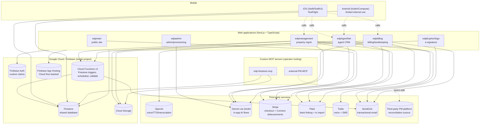

# Architecture

This document describes the verified architecture of the EDP ecosystem at a level useful for technical review. It intentionally omits operational specifics that don't belong in a public overview: real URLs, project IDs, document IDs, collection contents, credential names/values, and internal infrastructure hostnames.

## Shape of the system

Six web applications plus native mobile clients sharing one backend.

## Why six web apps instead of one

Each app maps to a distinct user population and a distinct deploy cadence: the public marketing site changes constantly (SEO, content, landing pages) and should never be blocked on a property-management release; the agent CRM has the heaviest, most transaction-critical data model; the property-management portal has the widest external user base (landlords, tenants, vendors) and a high bar for correctness because it touches money workflows. Splitting them means:

- Each app can deploy independently on its own schedule
- A bug or outage in one app (say, the e-sign product) doesn't take down the others
- Each app's Firebase App Hosting instance can be sized (CPU/memory/instance count) to its own traffic pattern instead of one shared, over-provisioned deployment

The cost, discussed honestly in [`engineering-decisions.md`](engineering-decisions.md), is schema drift across app boundaries and the absence of a single source of truth for shared concepts like "user" or "property" — each app owns some slice of the canonical data model, and cross-app consistency is a documentation and code-review discipline, not something the platform enforces for you.

## Shared Firestore, direct-access model

All six web apps and both mobile clients connect to **one Firestore project**. Rather than routing everything through an internal API layer, apps read and write Firestore collections directly, governed by Firestore security rules, and use a small number of HTTP endpoints on one another for operations that need centralized business logic (user provisioning, activity logging, magic-link SSO handoff between apps, push-token registration, e-sign packet handoff).

This was a deliberate build-speed choice: authorization is expressed in security rules, and consistency across apps comes for free from the shared store. The tradeoff — and why I'd introduce an internal API layer at larger scale — is discussed in [`engineering-decisions.md`](engineering-decisions.md) and [`security-and-privacy.md`](security-and-privacy.md).

## Authentication and role model

Firebase Authentication is the identity provider across every app. Authorization uses a role model that is **mid-migration from an older stored-role approach toward Firebase custom claims**, with a compatibility layer during the transition so that live user sessions and real access continue to work at every step. This is run as a **dual-write/backfill/cutover** migration rather than a hard switchover, because the system can't tolerate a risky big-bang cutover with real users depending on it — the details of running that kind of migration safely are in [`engineering-decisions.md`](engineering-decisions.md).

Data isolation between users is expressed primarily through **ownership and relationship fields on documents** — a lease is associated with its tenant, a property with its landlords — and rules resolve access from those relationships rather than a single partition key. An organization-level isolation concept (relevant to a possible future SaaS direction) is layered on top and is only partially applied today, which is fine for a single-organization deployment and tracked honestly in [`project-status.md`](project-status.md).

## Cloud Functions and event-driven work

Firebase Cloud Functions (2nd generation) run the ecosystem's background and scheduled work, concentrated in the property-management app: Firestore-triggered functions (fired when a maintenance request, application, or similar document is created or updated) handle notification fan-out to human stakeholders and route notifications into the AI-agent pipeline; scheduled functions handle time-based escalation of stale requests. The billing app has a smaller set of its own Cloud Functions for financial event handling. The other five apps have no custom Cloud Functions and rely on their own Next.js API routes for server-side logic.

## AI/LLM layer

There are two distinct AI subsystems in this codebase, and it's worth being precise about which is which:

1. **In-app AI flows (Genkit + Gemini)** — used inside the admin, billing, property-management, and agent-CRM apps for discrete, request/response AI tasks: summarizing a vendor quote, extracting structured data from a W-9 form, analyzing a maintenance description, drafting invoice notes, answering a property question. These are synchronous, scoped, single-purpose calls — not agents with persistent tool access.
2. **Pierce and the phone/SMS agent system (OpenAI)** — a materially different, more autonomous system: real-time voice conversations with function-calling tools operating over authorized operational data, SMS/email handled through a separate agent runtime, and event-driven behavior fed by the Cloud Functions above. This system, including how I distinguish implemented safeguards from active priorities, is described in [`ai-agent-system.md`](ai-agent-system.md).

## Third-party integrations

| Service | Used for | Where |
|---|---|---|
| Stripe | Checkout for invoice payments (the live payment path); a production-capable rent-charge flow and a Connect-based landlord-disbursement pipeline, with limited current adoption | edpmain (invoice checkout), edpmanagement (rent charge + disbursement), edpbilling |
| Plaid | Bank-account linking and transaction import for bookkeeping | edpAgentNet, edpmanagement, edpbilling |
| Twilio | Voice calls and SMS for the AI agent (Pierce) and human staff communication | edpAgentNet primarily, edpmanagement for a smaller set of automated messages |
| SendGrid | Transactional email (notifications, receipts, e-sign invitations, escalation emails) | Every app that sends email |
| Third-party property-management platform | Reconciliation with relevant external property-management records | Bridged via a custom MCP service for internal reconciliation, not a direct app integration |

See [Payments & rent](#payments-and-rent-precisely) below for the precise live-vs-capable distinction.

## Payments and rent (precisely)

Because payment claims are easy to overstate, here is the exact picture:

- **Invoice payments** run through a production **Stripe Checkout** path and are the live payment flow.
- **Rent collection through the app is production-capable**: the property-management app implements a real tenant rent-charge flow via Stripe Checkout, plus a landlord-disbursement pipeline built on **Stripe Connect** — including a held state for landlords who haven't completed payment onboarding. The charge → ledger → disbursement path exists end-to-end in code.
- **A third-party property-management platform is also reconciled with EDP** through internal operator tooling. This overview does not claim a specific share of rent volume for either payment path.
- **Plaid** handles bank-account linking and transaction import for bookkeeping.

The distinction that matters: rent collection is a *production-capable feature that exists and works*. This overview does not claim a specific adoption level or transaction volume. See [`project-status.md`](project-status.md) for the same distinction in table form.

## Documents: an in-house e-signature engine

`edpEuphoriSign` is not a DocuSign/HelloSign integration — it's a purpose-built signing engine: token-based signer access (no signer account required), ESIGN-consent capture, identity verification (access code and one-time-code options), sequential or parallel multi-recipient signing order, PDF field overlay and `pdf-lib`-based flattening of submitted values into a final document, and a tamper-evident audit trail implemented as a hash chain (each log entry's hash incorporates the previous entry's hash). Packet *creation* happens in the agent CRM; `edpEuphoriSign` owns the signer-facing experience and the background job queue that finalizes completed documents. It's an audit-grade, tamper-evident signing product; I describe it that way rather than asserting legal enforceability, which the implementation doesn't claim.

Separately, `edpAgentNet` uses Tesseract.js OCR to detect fillable fields on uploaded form templates, generating a reusable field map so future documents from that template can be auto-populated rather than manually annotated each time.

## Mobile

Native clients, not a cross-platform framework. The iOS app (Swift/SwiftUI) and Android app (Kotlin/Jetpack Compose) are both pure consumers of the same backend — they own no Firestore collections of their own and call into the agent CRM, property-management, and billing apps' APIs for anything beyond direct Firestore reads.

**Distribution, stated precisely:** the **iOS app is distributed through TestFlight** and is not publicly released on the App Store. The **Android app is in limited internal use** and is **not production-ready**: it has strong UI/view-model parity with iOS, but some of its data-layer repositories are still backed by stub implementations rather than live Firebase-backed ones. Even in TestFlight, the mobile release cadence is gated on Apple's review process, which is why mobile and web schema changes have to move in lockstep (see [`engineering-decisions.md`](engineering-decisions.md)).

## MCP layer (operator tooling, not end-user product)

Separately from the product itself, the real-world system includes custom Model Context Protocol (MCP) services that let an AI assistant operate business data day-to-day and bridge to the third-party property-management platform for reconciliation. These are internal operator tools, not something end users touch. They're worth mentioning because they're a real example of production MCP tooling built with **access controls in mind**: staged read/write/approve tool modes, an approval step for destructive operations, and, in a permission-scoped variant, collection-level access restrictions and field-level redaction of sensitive values before data is returned to the assistant. I describe these at the level of "designed with least-privilege controls" rather than publishing their internal configuration.

## What I'd change with 10x the usage

Covered in depth in [`engineering-decisions.md`](engineering-decisions.md#what-should-change-if-usage-increases-substantially), but briefly: introduce an internal API layer between apps so authorization is centralized rather than expressed per-app; complete the custom-claims migration; move key AI-agent business constraints and approval steps into server-side, testable enforcement; and broaden automated test coverage before iterating at higher scale.
